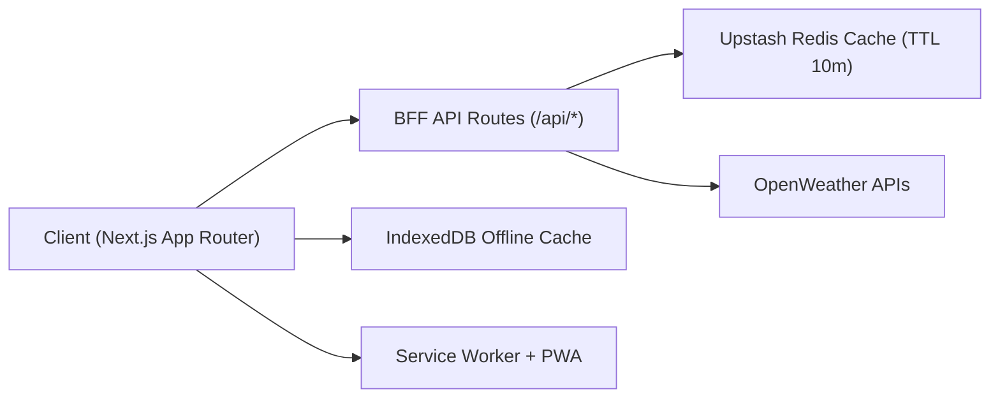

# LuxuryWeather

[Live Demo](https://luxury-weather.vercel.app)

Production-ready weather platform built with Next.js App Router, TypeScript, Tailwind CSS, and a secure BFF architecture.

## Design Philosophy
> "Design is not just what it looks like and feels like. Design is how it works."

LuxuryWeather was built on the premise that true technical mastery allows the engineering to disappear.  
Every cache layer, lazy-loaded chunk, and fallback path exists so the user never has to think about them.  
The app handles the edge cases so the user can simply look at the sky.

## What This App Delivers

- Instant weather load via geolocation with graceful fallback to `London`.
- Human-centered weather experience with cinematic glass UI and contextual backgrounds.
- 24-hour trend chart, AQI, map, and robust search suggestions.
- Reliable behavior across weak networks, offline states, and mobile devices.

## Architecture Overview



## Core Engineering Highlights

### Security and Backend (BFF)
- OpenWeather API key is used only server-side (`process.env.OPENWEATHER_API_KEY`).
- `GET /api/weather` supports `city` or `lat/lon` and returns a minified payload.
- AQI is integrated through OpenWeather Air Pollution API.
- Explicit upstream fallback logic avoids blanket `catch` anti-patterns.

### Caching and Throughput
- Upstash Redis edge cache with deterministic keys and `EX 600`.
- CDN-friendly response headers (`public, s-maxage=300, stale-while-revalidate=600`).
- `X-Cache` observability headers (`HIT | MISS | BYPASS`).
- Prefetch endpoint warms cache on intentional hover (300ms).

### Abuse Protection
- Route-level sliding-window rate limits:
  - `/api/weather`
  - `/api/cities`
  - `/api/weather/prefetch`
- Retry headers surfaced and consumed by frontend cooldown UX.

### Offline-First Reliability
- IndexedDB (`idb-keyval`) stores weather snapshots with TTL handling.
- Subtle offline mode:
  - background desaturation
  - low-opacity `Updated ... ago` timestamp
- `/offline` route renders last known weather from IndexedDB.

### Performance Engineering
- Dynamic imports for heavy UI: map, chart, animated weather icon.
- `LazyMotion` + `m` primitives to reduce Framer Motion critical payload.
- `.lottie` compressed animation assets loaded by condition (`src=/lottie/*.lottie`).
- Low-power mode using:
  - `prefers-reduced-motion`
  - Network Information API (`saveData`, connection type)
  - Device Memory API
- On low-power/touch devices:
  - heavy scene FX disabled
  - chart deferred to idle
  - map becomes on-demand
  - mobile scroll flicker mitigated by reducing fixed-layer repaint pressure

## Product Experience

- Magnetic expanding search with spring animation and `Cmd/Ctrl + K`.
- Debounced search (`500ms`) and suggestion prefetch (`300ms` hover intent).
- Humanized status/error messaging (non-technical language).
- Refined typographic hierarchy for location, condition, and temperature.
- Responsive design optimized for smartphone-first interactions.

## API Endpoints

### `GET /api/weather`
Query:
- `city=Berlin`
- or `lat=52.52&lon=13.41`

Returns:
- `location`: `name`, `country`, `lat`, `lon`
- `current`: `temp`, `condition`, `description`, `icon`, `humidity`, `wind`, `pressure`, optional `aqi`
- `aqi` at root level
- `hourly` (next 24 points): `ts`, `temp`, `condition`, `icon`

Errors:
- `400` missing/invalid params
- `404` city not found
- `429` rate limited
- `500` config/upstream failure

### `GET /api/cities`
- Geocoding suggestions for search dropdown.

### `GET /api/weather/prefetch`
- Cache warmup endpoint for hover-intent suggestion prefetch.
- Returns `204` on success.

## Tech Stack

- Next.js 14 (App Router)
- TypeScript
- Tailwind CSS
- Framer Motion
- Lucide React
- Recharts
- React-Leaflet + Leaflet
- `@lottiefiles/dotlottie-react`
- `@upstash/redis`
- `@upstash/ratelimit`
- `idb-keyval`
- `use-debounce`
- `next-pwa`

## Local Development

### 1) Install
```bash
npm install
```

### 2) Configure Environment
Create `.env.local`:

```env
OPENWEATHER_API_KEY=your_openweather_key
UPSTASH_REDIS_REST_URL=your_upstash_url
UPSTASH_REDIS_REST_TOKEN=your_upstash_token
```

### 3) Run
```bash
npm run dev
```

Open [http://localhost:3000](http://localhost:3000).

### 4) Production Build
```bash
npm run build
npm run start
```

## Deploying to Vercel

1. Push to GitHub.
2. Import repo into Vercel.
3. Add env vars in Vercel project settings:
   - `OPENWEATHER_API_KEY`
   - `UPSTASH_REDIS_REST_URL`
   - `UPSTASH_REDIS_REST_TOKEN`
4. Deploy.

No code changes are required for deployment.
