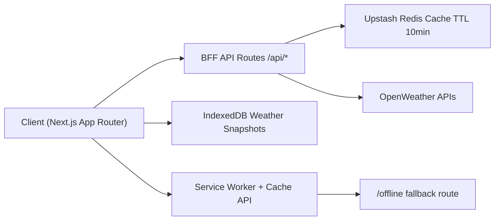

# LuxuryWeather

> A weather app on the surface. A systems design exercise underneath.

[](https://luxury-weather.vercel.app)


---

## The Problem I Was Actually Solving

Most weather apps stop at being API wrappers with a polished UI. I wanted to solve the harder systems question: what does it take to make a small app stay reliable under real-world constraints. In this project, dropped networks, low-battery devices, burst traffic, and API-limit pressure were treated as primary requirements instead of edge cases. The result is a weather app that behaves like a production system, not a demo.

---

## Architecture



The app follows a Backend-for-Frontend pattern: the browser only talks to internal `/api/*` routes, and those routes own all upstream OpenWeather communication. This keeps request shaping, caching, and rate limiting centralized on the server layer. Because the OpenWeather key is resolved only inside server code, it never needs to be shipped to client bundles.

---

## Engineering Decisions (The Interesting Parts)

### 1. Collapsing Duplicate Upstream Work

The weather endpoint uses Redis with deterministic keys and `EX 600` to absorb repeated traffic for identical queries, using `weather:city:${city.toLowerCase()}` for city lookups and `weather:coords:${lat.toFixed(3)}:${lon.toFixed(3)}` for coordinate lookups. Each `/api/weather` response includes `X-Cache: HIT | MISS | BYPASS` so cache behavior is directly observable during debugging and load tests. Search suggestions use hover intent, and after 300ms of deliberate hover, the app calls `/api/weather/prefetch` to warm Redis before selection. Under shared query patterns, Redis plus CDN caching (`s-maxage=300`) collapses duplicate upstream work so most repeated city requests do not reach OpenWeather.

### 2. Hardware Empathy

`useLowPowerMode.ts` reads `navigator.getBattery()`, `navigator.connection.saveData`, `navigator.deviceMemory`, and `window.matchMedia('(prefers-reduced-motion: reduce)')` to detect constrained environments. When low-power mode is active, the UI shifts to reduced-motion paths, avoids non-essential Framer Motion transitions, skips heavy scene effects, and falls back from Lottie weather animation to static icons. This is intentionally quiet behavior: the app adapts itself without surfacing technical state to the user. The core design choice is that performance adaptation should feel invisible rather than explicit.

### 3. Offline-First, Not Offline-Fallback

Offline reliability uses two complementary layers. Workbox Cache API strategies in the service worker handle runtime/static caching and route document failures to `/offline`, while `idb-keyval` in IndexedDB stores weather snapshots with timestamp-based freshness rules. The `/offline` route then renders last known weather data instead of a generic disconnected screen. In the primary UI, offline state is conveyed subtly through background desaturation and an `Updated X ago` indicator, so degradation is graceful instead of disruptive.

### 4. Infrastructure Protection

All externally reachable weather-related routes are protected with sliding-window limits: `/api/weather`, `/api/cities`, and `/api/weather/prefetch`. On `429`, the API emits `Retry-After`, and the client consumes that header to enforce visible cooldown timing for direct searches while suppressing noisy failures for background prefetch calls. If Redis is unavailable, the server falls back to an in-process limiter so the endpoints are still capped. The key principle is simple: uncapped public endpoints are an infrastructure risk, not a missing feature.

---

## Performance Profile

| Metric | Result |
|--------|--------|
| Largest JS chunk | ~390 KB uncompressed |
| TypeScript errors | 0 |
| Cache TTL | 600s (Redis) + 300s (CDN s-maxage) |
| Offline support | Full (IndexedDB + Service Worker) |
| Rate limiting | Sliding window, all API routes |

---

## What I'd Do Differently at 10x Scale

At significantly higher scale, I would move from a single serverless Redis dependency to region-aware cache placement to reduce tail latency across geographies. I would also add a queue-based strategy for burst handling so selected requests can be deferred instead of immediately rejected on 429 during spikes. Observability would be expanded with end-to-end OpenTelemetry traces across the BFF layer and upstream calls to make cache effectiveness and failure modes measurable per route. Finally, I would evaluate edge rendering with geolocation-aware defaults so first paint can arrive with weather context before interaction.

---

## Local Development

### Prerequisites
- Node.js 18+
- Upstash Redis account (free tier works)
- OpenWeatherMap API key (free tier works)

### Setup

```bash
git clone https://github.com/shivamsingh190103/LuxuryWeather.git
cd LuxuryWeather
npm install
```

Create `.env.local`:

```env
OPENWEATHER_API_KEY=your_key_here
UPSTASH_REDIS_REST_URL=your_upstash_url
UPSTASH_REDIS_REST_TOKEN=your_upstash_token
```

```bash
npm run dev
# Open http://localhost:3000
```

### Production Build

```bash
npm run build
npm run start
```

### Verify Caching

```bash
# First request — should return X-Cache: MISS
curl -I http://localhost:3000/api/weather?city=London

# Second request — should return X-Cache: HIT  
curl -I http://localhost:3000/api/weather?city=London
```

---

## Deploying to Vercel

1. Push to GitHub
2. Import repo at vercel.com/new
3. Add environment variables in Vercel project settings:
   - OPENWEATHER_API_KEY
   - UPSTASH_REDIS_REST_URL
   - UPSTASH_REDIS_REST_TOKEN
4. Deploy — no code changes required

---

## Tech Stack

| Layer | Technology |
|-------|-----------|
| Framework | Next.js 14 (App Router) |
| Language | TypeScript |
| Styling | Tailwind CSS |
| Animations | Framer Motion + Lottie |
| Charts | Recharts |
| Map | React-Leaflet |
| Cache | Upstash Redis |
| Rate Limiting | @upstash/ratelimit |
| Offline Storage | idb-keyval (IndexedDB) |
| PWA | next-pwa + Workbox |
| Deployment | Vercel |

---

## Author

Built by Shivam Singh — final semester, A.K.G.E.C.  
[LinkedIn URL] · [GitHub URL](https://github.com/shivamsingh190103/LuxuryWeather)
